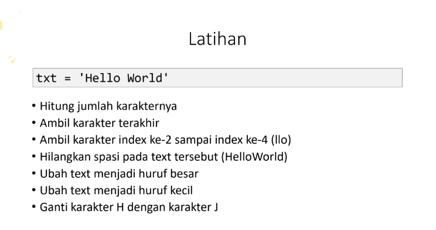
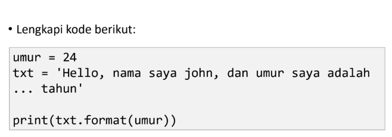
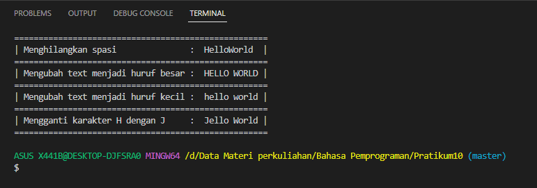
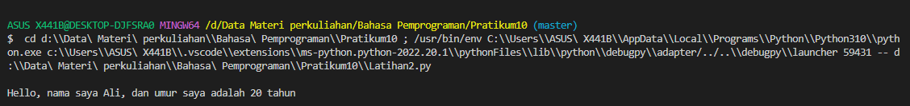

# Pratikum10

Nama    :   Muhamad Ali M</br>
NIM     :   312210540</br>
Kelas   :   TI.22.B2</br>

# Pertemuan 14 : Python String
### Apa itu Python String?
- String adalah jenis yang paling populer di Python.
- Untuk membuatnya hanya dengan melampirkan karakter dalam tanda kutip.
- Python memperlakukan tanda kutip tunggal sama dengan tanda kutip ganda.
- Membuat string semudah memberi nilai pada sebuah variabel.
### 1. Latihan 

### 2. Latihan

### Source Code


### A. Penjelasan Latihan 1
1.  Untuk menghitung karakter pada string yaitu menggunakan Fungsi `len()`.</br>
Contoh:
```py
print(len(txt))
```
Fungsi len() pada python di gunakan untuk menghitung karakter pada string.
- Fungsi len() pada python di gunakan untuk menghitung karakter pada string.

2. Jika ingin mengambil karakter terakhir, gunakan index `[-1]`.</br>
Contoh:
@@ -72,7 +72,7 @@ print(txt.replace("H", "J"))

### B. Penjelasan Latihan 2

Untuk memasukkan variable ke dalam string, tambahkan kurung kurung awal dan kurung akhir `{}` untuk menempatkan variable sebelumnya.</br>
- Untuk memasukkan variable ke dalam string, tambahkan kurung kurung awal dan kurung akhir `{}` untuk menempatkan variable sebelumnya.</br>
Contoh:
```py
    umur = 24
    
    txt = "Hello, nama saya john, dan umur saya adalah {0} tahun"
    print(txt.format(umur))
```
### C. Hasil Output
- Latihan 1</br>

- Latihan 2</br>

# *SEKIAN, TERIMA KASIH :)*
